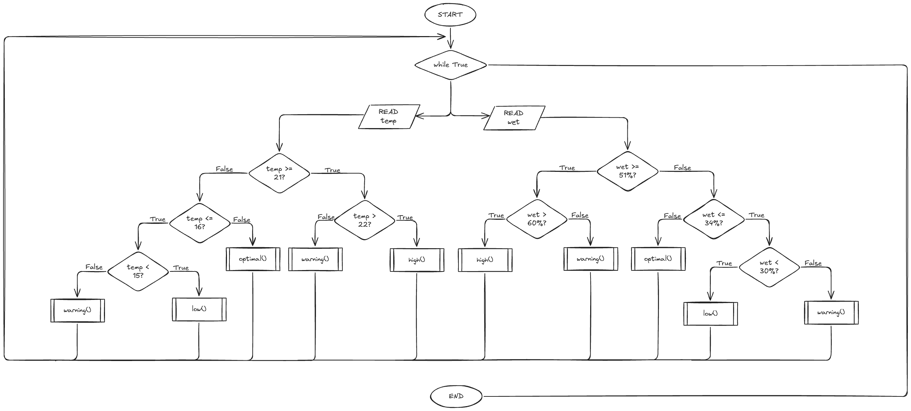

# Requirements Outline
## Defining the Purpose
### The Need
When it is cold, my room often becomes damp, leading to mould growth. However, I have no way to identify if the room is too cold or too damp so I am unable to prevent the mould effectively. The only option to warm the room up is air conditioning, but if I am not sure if the room is too cold or damp, it is wasting electricity.
### Proposed Solution
I will design a temperature and humidity sensor to sense when the conditions of the room enter optimal mould growth. When the temperature or humidity are too low/high, a buzzer will ring, that can be turned off with a clap, to prompt me when to turn on air conditioning or open a window to remove moisture. 2 LEDs for each sensor will be used to check how close the measurement is to optimal mould growing conditions.
## Identify Key Actions
- Different frequencies of buzzer rings when temperature or humidity enter mould growing range. The sensors detect temperature and humidity every 5 seconds.
- Blue LED is switched on when the temperature and humidity are below, a red LED is turned on when the temperature and humidity enter mould growing range and a green LED is used to represent good conditions.
- The buzzers are able to be turned off by a clap.
## Functional Requirements
The temperature sensor detects when the temperature exits the range from 15-22 degrees celsius, keeping the temperature outside of mould growing temperatures.

The humidity sensor detects when the humidity is out of the range from 30-60%, ensuring mould does not grow, as it grows from 60% and above.

A blue LED is used to represent when conditions are too cold or when the humidity is too low. 
A green LED represents the temperature being in optimal coniditions, 15-22 and humidity being in optimal conditions, 30-60%.
A yellow LED represents when the temperature or humidity are close to exiting the optimal conditions, meaning 16 or 21 degrees or 35 or 55% humidity to prevent mould growth.
A red LED is turned on when the temperature and humidity are outside the ranges of 15-22 and 30-50%, activating a buzzer a minute after no clap is detected.

A sound sensor detects a clap when the buzzer is turned on, turning it off for 10 minutes once a clap is detected or a similar sound. This allows the user to correct the humidity and temperature.
## Test Cases
| Test Case | Input     | Expected Output   |
|---------- |---------- |----------------   |
|Temperature too high| Temperature sensor reads >22°C | Red LED turns on and a minute later if no clap is detected, the buzzer turns on |
| Temperature in high range | Temperature sensor reads 21-22°C | Yellow LED turns on |
| Temperature in optimal range | Temperature sensor reads 16-21°C | Green LED on |
| Temperature in low range | Temperature sensor reads 15-16°C | Blue LED turns on |
| Temperature too low | Temperature sensor reads <15°C | Red LED turns on and a minute later if no clap is detected, the buzzer turns on |
|Humidity too high| Humidity sensor reads >60% | Red LED turns on and a minute later if no clap is detected, the buzzer turns on |
| Humidity in high range | Humidity sensor reads 51-60% | Yellow LED turns on |
| Humidity in optimal range | Humidity sensor reads 35-50% | Green LED on |
| Humidity in low range | Humidity sensor reads 30-34% | Blue LED turns on |
| Humidity too low | Humidity sensor reads <30% | Red LED turns on and a minute later if no clap is detected, the buzzer turns on |
| Clap detected | Sound sensor detects a frequency from 2200 to 2800Hz | All buzzers are turned off for 10 minutes |
## Non-Functional Requirements
### Efficiency 
The robot will detect changes in the environment every 5 seconds ensuring efficiency. The clap is detected every 0.1 seconds and the program uses multiple LEDs, two buzzers and a sound sensor.
### Reaction Time
The robot will react to environment change every 5 seconds and detect claps every 0.1 seconds, ensuring fast reaction times for user inputs.
### Accuracy
The robot will measure temperature and humidity correct to 1 decimal place, being fairly accuracte. The robot will also detect a sharp clap and differentiate it through the frequency of the sound.

# Design

# Development and Integration

# Testing and Debugging

# Evaluation
