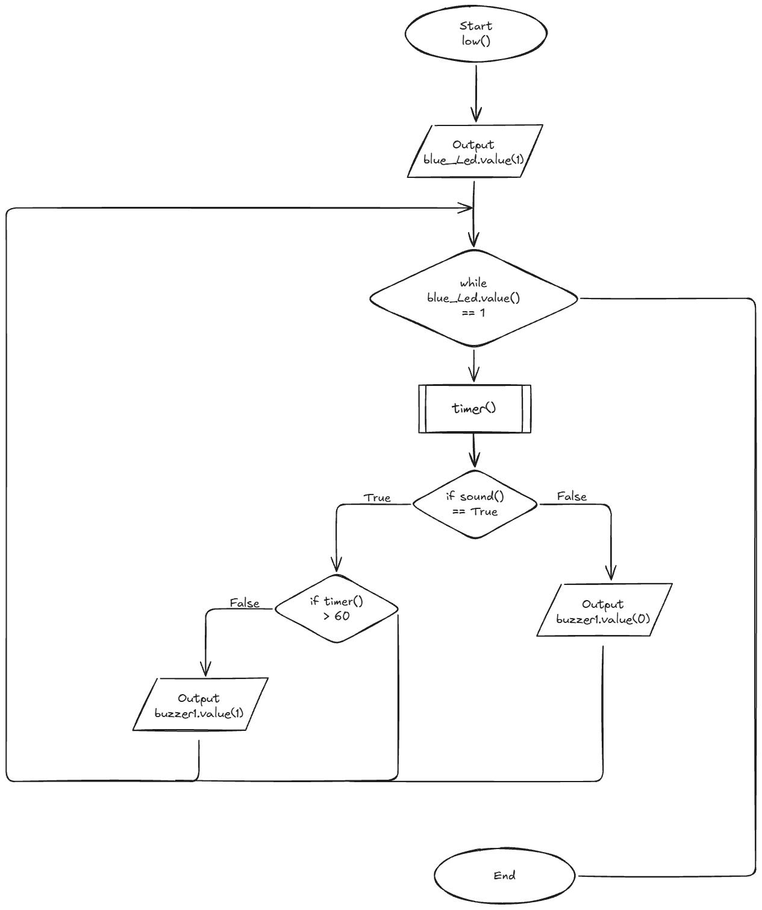
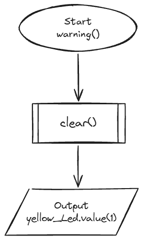

# Requirements Outline
## Defining the Purpose
### The Need
When it is cold, my room often becomes damp, leading to mould growth. However, I have no way to identify if the room is too cold or too damp so I am unable to prevent the mould effectively. The only option to warm the room up is air conditioning, but if I am not sure if the room is too cold or damp, it is wasting electricity.
### Proposed Solution
I will design a temperature and humidity sensor to sense when the conditions of the room enter optimal mould growth. When the temperature or humidity are too low/high, a buzzer will ring, that can be turned off with a clap, to prompt me when to turn on air conditioning or open a window to remove moisture. 2 LEDs for each sensor will be used to check how close the measurement is to optimal mould growing conditions.
## Identify Key Actions
- Different frequencies of buzzer rings when temperature or humidity enter mould growing range. The sensors detect temperature and humidity every 5 seconds.
- Blue LED is switched on when the temperature and humidity are below, a red LED is turned on when the temperature and humidity enter mould growing range and a green LED is used to represent good conditions.
- The buzzers are able to be turned off by a clap.
## Functional Requirements
The temperature sensor detects when the temperature exits the range from 15-22 degrees celsius, keeping the temperature outside of mould growing temperatures.

The humidity sensor detects when the humidity is out of the range from 30-60%, ensuring mould does not grow, as it grows from 60% and above.

A blue LED is used to represent when conditions are too cold or when the humidity is too low. 
A green LED represents the temperature being in optimal coniditions, 15-22 and humidity being in optimal conditions, 30-60%.
A yellow LED represents when the temperature or humidity are close to exiting the optimal conditions, meaning 16 or 21 degrees or 35 or 55% humidity to prevent mould growth.
A red LED is turned on when the temperature and humidity are outside the ranges of 15-22 and 30-50%, activating a buzzer a minute after no clap is detected.

A sound sensor detects a clap when the buzzer is turned on, turning it off for 10 minutes once a clap is detected or a similar sound. This allows the user to correct the humidity and temperature.
## Test Cases
| Test Case | Input     | Expected Output   |
|---------- |---------- |----------------   |
|Temperature too high| Temperature sensor reads >22°C | Red LED turns on and a minute later if no clap is detected, the buzzer turns on |
| Temperature in high range | Temperature sensor reads 21-22°C | Yellow LED turns on |
| Temperature in optimal range | Temperature sensor reads 16-21°C | Green LED on |
| Temperature in low range | Temperature sensor reads 15-16°C | Blue LED turns on |
| Temperature too low | Temperature sensor reads <15°C | Red LED turns on and a minute later if no clap is detected, the buzzer turns on |
|Humidity too high| Humidity sensor reads >60% | Red LED turns on and a minute later if no clap is detected, the buzzer turns on |
| Humidity in high range | Humidity sensor reads 51-60% | Yellow LED turns on |
| Humidity in optimal range | Humidity sensor reads 35-50% | Green LED on |
| Humidity in low range | Humidity sensor reads 30-34% | Blue LED turns on |
| Humidity too low | Humidity sensor reads <30% | Red LED turns on and a minute later if no clap is detected, the buzzer turns on |
| Clap detected | Sound sensor detects a frequency from 2200 to 2800Hz | All buzzers are turned off for 10 minutes |
## Non-Functional Requirements
### Efficiency 
The robot will detect changes in the environment every 5 seconds ensuring efficiency. The clap is detected every 0.1 seconds and the program uses multiple LEDs, two buzzers and a sound sensor.
### Reaction Time
The robot will react to environment change every 5 seconds and detect claps every 0.1 seconds, ensuring fast reaction times for user inputs.
### Accuracy
The robot will measure temperature and humidity correct to 1 decimal place, being fairly accuracte. The robot will also detect a sharp clap and differentiate it through the frequency of the sound.

# Design
## Flowcharts



## Pseudocode
```
BEGIN low()
    OUTPUT blue_Led.value(1)
    WHILE blue_Led.value(1)
        timer()
        IF sound() == True THEN
            IF timer() > 60 THEN
            OUTPUT buzzer1.value(1)
            ELSE
                pass
            ENDIF
        ELSE
            OUTPUT buzzer1.value(0)
        ENDIF
    ENDWHILE
END low()

BEGIN warning()
    clear()
    OUTPUT yellow_Led.value(1)
END warning()

BEGIN
    WHILE True
        READ temp
        READ wet
        IF temp >= 21 THEN
            IF temp > 22 THEN
                high()
            ELSE
                warning()
            ENDIF
        ELSE
            IF temp <= 16 THEN
                IF temp < 15 THEN
                    low()
                ELSE
                    warning()
                ENDIF
            ELSE
                optimal()
            ENDIF
        ENDIF
        IF wet >= 51 THEN
            IF wet > 60 THEN
                high()
            ELSE
                warning()
            ENDIF
        ELSE
            IF wet <= 34 THEN
                IF wet < 30 THEN
                    low()
                ELSE
                    warning()
                ENDIF
            ELSE
                optimal()
            ENDIF
        ENDIF
    ENDWHILE
END
```

# Testing and Debugging
## Test Case #1: High(both temperature and humidity)
### Choose a Test Case
| Test Case | Input     | Expected Output   |
|---------- |---------- |----------------   |
|Temperature/humidity too high| Temperature sensor reads >22°C, Humidty sensor reads > 60% | Red LED turns on and a minute later if no clap is detected, the buzzer turns on |
### Outline Your Plan
Improvements that need to be made my current code include, making two functions for both temperature and humidity, code efficiency and organisation also needs to be fixed. 
### Adjust and Test Your Code
#### Test #1 of code
```
def high():
    if temp > 22:
        r1.value(1)
        g1.value(0)
        b1.value(0)
        timer()
        while r1.value() == 1:
            if sound() == True:
                if checktimer() < 60000: #Check if is under 60 seconds
                    buzzer1.value(0)
                    disablebuzzer()
                else:
                    buzzer1.value(0)
                    disablebuzzer()
            else:
                if checktimer() > 60000:
                    if checkbuzzer():
                        buzzer1.value(1)
                    else:
                        buzzer1.value(0) 
    elif wet > 60:
        r2.value(1)
        g2.value(0)
        b2.value(0)
        timer()
        while r2.value() == 1:
            if sound() == True:
                if checktimer() < 60000: #Check if is under 60 seconds
                    buzzer2.value(0)
                    disablebuzzer()
                else:
                    buzzer2.value(0)
                    disablebuzzer()
            else:
                if checktimer() > 60000:
                    buzzer2.value(1)
                else:
                    buzzer2.value(0)
```
#### Test #2 of code
```
def high1():
    """Used for the temperature whenever it goes too high. Turns on a red LED and a buzzer a minute later if there is no sound."""
    if r1.value() == 0: # #This is done to ensure the timer is enabled once, only when the red light first turns on. This code was done with AI as I could not figure out why the timer was never able to reach 1 minute.
        r1.value(1)
        g1.value(0)
        b1.value(0)
        timer1()
        
    if check_sound() == True:
        buzzer1.value(0)
        disablebuzzer1()
    else:
        if checktimer1() > 60000:
            if checkbuzzer1() == True:
                buzzer1.value(1)
            else:
                buzzer1.value(0)
        else:
            buzzer1.value(0)
```
#### Test #4 of code
```
def high1():
    """Used for the temperature whenever it goes too high. Turns on a red LED and a buzzer a minute later if there is no sound."""
    if r1.value() == 1: #This is done to ensure the timer is enabled once, only when the red light first turns on. This code was done with AI as I could not figure out why the timer was never able to reach 1 minute.
        r1.value(0)
        g1.value(1)
        b1.value(1)
        timer1()
    if checkbuzzer1(): #Checks if the buzzer is disabled or not
        while checktimer1() < 60000: #While the timer is at less than a minute check for sound
            if sound() == True:
                buzzer1.duty_u16(0)
                disablebuzzer1()
                r1.value(1)
                sleep(0.05)
                break
        if checkbuzzer1(): #If theres no sound, ring a buzzer that can be turned off with sound
            buzzer1.duty_u16(32768)
            while True:
                if sound() == True:
                    buzzer1.duty_u16(0)
                    disablebuzzer1()
                    r1.value(1)
                    sleep(0.05)
                    break
        else:
            buzzer1.duty_u16(0) #If the buzzer is disabled then make sure its off
    else:
        buzzer1.duty_u16(0) 
```
#### Test #5 of code
```
def high1():
    """Used for the temperature whenever it goes too high. Turns on a red LED and a buzzer a minute later if there is no sound."""
    if r1.value() == 1: #This is done to ensure the timer is enabled once, only when the red light first turns on. This code was done with AI as I could not figure out why the timer was never able to reach 1 minute.
        r1.value(0)
        g1.value(1)
        b1.value(1)
        timer1() #Begin the timer
    if sound() == True: #Check for sound to turn the buzzer off
        buzzer1.duty_u16(0)
        disablebuzzer1()
        r1.value(1) #Reset LED so the timer can be reenabled
    else:
        if checkbuzzer1(): #If buzzer is available
            if checktimer1() > 60000: #Check if a minute has passed
                buzzer1.duty_u16(32768)
            else:
                buzzer1.duty_u16(0)
        else:
            buzzer1.duty_u16(0) 
```
### Evaluate Your Process
#### How successful were you in meeting the test case requirements?
I was very successful in meeting the requirements for the test case, as code successfully rings a buzzer a minute after the temperature or humidity goes too high. Steps I took to identify errors included singling out specific lines of code and testing them, for example, to test if sound could successfully turn off the buzzer, I would create a new temporary Thonny file and paste my code and imports in. I would then turn on the buzzer and check if the sound can turn off the buzzer. Turning on the lights and turning off the buzzer went well, successfully working each time during testing. The most challenging part was making sure the buzzer turned on after a minute and could be disabled at any point. The code could be improved in terms of efficiency, making some parts shorter and function better.

## Test Case #2: Low(both temperature and humidity)
### Choose a Test Case
| Test Case | Input     | Expected Output   |
|---------- |---------- |----------------   |
| Humidity/temperature too low | Humidity/temperature sensor reads <30%, Temperature reads <15°C | Red LED turns on and a minute later if no clap is detected, the buzzer turns on |
### Outline Your Plan
Improvements that need to be made, similar to high, include seperating functions and improving code efficiency and organsiation. Another improvement to be made is making the low level turn blue rather than red. This is to reduce amount of code needed for a similar result.
### Adjust and Test Your Code
During this process, the code for low was not developed as it was simply adapted from the high function. Code for low only existed at the start and finish.
#### Test #1 of code
```
def low1():
    """Used for the humidity whenever it goes too low. Turns on a red LED and a buzzer a minute later if there is no sound."""
    if b1.value() == 1: #This is done to ensure the timer is enabled once, only when the red light first turns on. This code was done with AI as I could not figure out why the timer was never able to reach 1 minute.
        r1.value(1)
        g1.value(1)
        b1.value(0)
        timer1()
    if checkbuzzer1(): #Checks if the buzzer is disabled or not
        while checktimer1() < 60000: #While the timer is at less than a minute check for sound
            if sound() == True:
                buzzer1.duty_u16(0)
                disablebuzzer1()
                b1.value(1)
                sleep(0.05)
                break
        if checkbuzzer1(): #If theres no sound, ring a buzzer that can be turned off with sound
            buzzer1.duty_u16(32768)
            while True:
                if sound() == True:
                    buzzer1.duty_u16(0)
                    disablebuzzer1()
                    b1.value(1)
                    sleep(0.05)
                    break
        else:
            buzzer1.duty_u16(0) #If the buzzer is disabled then make sure its off
    else:
        buzzer1.duty_u16(0) 
```
#### Test #2 of code(final)
```
def low1():
    """Used for the temperature whenever it goes too high. Turns on a red LED and a buzzer a minute later if there is no sound."""
    if b1.value() == 1: #This is done to ensure the timer is enabled once, only when the red light first turns on. This code was done with AI as I could not figure out why the timer was never able to reach 1 minute.
        r1.value(1)
        g1.value(1)
        b1.value(0)
        timer1()
    if sound() == True:
        buzzer1.duty_u16(0)
        disablebuzzer1()
        r1.value(1)
    else:
        if checkbuzzer1(): #If theres no sound, ring a buzzer that can be turned off with sound
            if checktimer1() > 60000:
                buzzer1.duty_u16(32768)
            else:
                buzzer1.duty_u16(0) #If the buzzer is disabled then make sure its off
        else:
            buzzer1.duty_u16(0)
```
### Evaluate Your Process
I was very successful in reaching the criteria of the test cases, as similar to high, I was able to successfully turn on the blue LED and turn a buzzer on a minute later if there is no sound detected. Steps used to identify and fix errors include just running the code, looking what lines things went wrong in the shell and isolating specific parts. Parts that went well, similar to Test Case 1, include turning off the buzzer with sound and turning the lights on. Challenging and difficult parts included making sure the buzzer was off after a minute and could be disabled once on or before the minute was up. For improvement, the code could be more efficient and function a little better.

## Test Case #3: Optimal(both temperature and humidity)
### Choose a Test Case
| Test Case | Input     | Expected Output   |
|---------- |---------- |----------------   |
| Temperature/humidty in optimal range | Temperature sensor reads 16-21°C, Humidity sensor reads 35-50% | Green LED on |
### Outline Your Plan
Ensure the green light turns on when required.
### Adjust and Test Your Code
The code for optimal stayed the same throughout the project other than a few minor changes.
#### Test #1 of code
```
def optimal():
    r1.value(1)
    g1.value(0)
    b1.value(1)
```
#### Test #2 of code
```
def optimal1():
    r1.value(1)
    g1.value(0)
    b1.value(1)
    buzzer1.duty_u16(0)
```
### Evaluate Your Process
I was very successful in meeting the test case requirements as it only required for a green LED to be turned on when certain conditions were met. No steps for fixing errors were required for this test case in particular as it was a very simple task. Turning the green LED went very well. No parts of this test case were challenging. The test case does not have much room for improvement, except for potentially removing the extra line of code added at the end. The line of code at the end was placed to ensure the buzzer stays off.

## Test Case #4: Warning(both temperature and humidity)
### Choose a Test Case
| Test Case | Input     | Expected Output   |
|---------- |---------- |----------------   |
| Temperature in high range | Temperature sensor reads 21-22°C | Yellow LED turns on |
| Temperature in low range | Temperature sensor reads 15-16°C | Blue LED turns on |
| Humidity in high range | Humidity sensor reads 51-60% | Yellow LED turns on |
| Humidity in low range | Humidity sensor reads 30-34% | Blue LED turns on |
### Outline Your Plan
Improvements that could be made to this code is making yellow the universal warning colour to reduce amount of possibilities and reduce code required.
### Adjust and Test Your Code
#### Test #1 of code
```
def warning():
    r1.value(0)
    g1.value(0)
    b1.value(1)
```
#### Test #2 of code(final)
```
def warning1():
    r1.value(0)
    g1.value(0)
    b1.value(1)
    buzzer1.duty_u16(0)

def warning2():
    r2.value(1)
    g2.value(1)
    b2.value(0)
    buzzer1.duty_u16(0)
```
### Evaluate Your Process
I was successful in reaching the requirements outline, however, I ended up changing from having the warning light be both blue and yellow to only being blue. This was done to reduce amount of code required and improve efficiency. Ensuring the lights turned on went well. There were only minor challenges during the test cases, these include small typos that messed with the light colour. Areas of code that could be improved after testing could be the future addition of the original yellow and blue warning colours.

## Test Case #5: Sound Sensor
### Choose a Test Case
| Test Case | Input     | Expected Output   |
|---------- |---------- |----------------   |
| Clap detected | Sound sensor detects a frequency from 2200 to 2800Hz | All buzzers are turned off for 10 minutes |
### Outline Your Plan
Create timer functions that can be used to disable the buzzer as well as detect sound and activate the disable buzzer function.
### Adjust and Test Your Code
#### Test #1 of code
```
def disablebuzzer():
    """Acts as a timer function to disable the buzzer. This starts the buzzer."""
    global disable
    disable = time.tick_ms()

def checkbuzzer():
    """Used whenever the buzzer is supposed to turn on. Checks if 10 minutes is up to allow the buzzer to turn on."""
    current_time = time.tick_ms() - disable
    if current_time < 600000:
        return False
    else:
        return True

def sound():
    if buzzer.value() or r.value() == 1:
        while True:
            sound = sound.value()
            if sound == 1:
                buzzer.value(0)
                sleep(0.1)
            else:
                led.value(0)
```
#### Test #2 of code
```
def disablebuzzer1():
    """Acts as a timer function to disable the buzzer. This starts the buzzer."""
    global disable1
    disable1 = utime.ticks_ms()

def checkbuzzer1():
    """Used whenever the buzzer is supposed to turn on. Checks if 10 minutes is up to allow the buzzer to turn on."""
    try:
        current_time1 = utime.ticks_ms() - disable1
        if current_time1 < 600000:
            return False
        else:
            return True
    except:
        return True

def disablebuzzer2():
    """Acts as a timer function to disable the buzzer. This starts the buzzer."""
    global disable2
    disable2 = utime.ticks_ms()

def checkbuzzer2():
    """Used whenever the buzzer is supposed to turn on. Checks if 10 minutes is up to allow the buzzer to turn on."""
    try:
        current_time2 = utime.ticks_ms() - disable2
        if current_time2 < 600000:
            return False
        else:
            return True
    except:
        return True

def sound():
    if soundsensor.value() == 1:
        return True
    if soundsensor.value() == 0:
        return False
```
### Evaluate Your Process
I was partly successful in meeting the test case requirements as I was able to successfully turn off the buzzer with a clap, however, it did not end up turning off only to a sound from 2200 to 2800Hz. Steps I took to identify and fix errors include running parts of code on their own, like the disable and check buzzer functions, ensuring that they both successfully can disable and start the buzzers. The part that went particularly well during testing was the sound sensor successfully performing its expected actions. Challenging parts were disabling the buzzer as if code went in the wrong order or skipped parts, essential parts of checking and disabling the buzzer would create errors. Parts of the code that could be improved after testing include the sound sensor by fully utilising the sensor's capabilities and potentially improving issues caused if certain variables of the buzzer functions are undefined.

# Evaluation
## Peer Evaluation 1():
|Plus|Minus|Implication|
|-|-|-|
| | | |
## Peer Evaluation 2():
|Plus|Minus|Implication|
|-|-|-|
| | | |

## Final Evaluation Questions
### Functional Criteria
### Non-Functional Criteria
### Relation to Idenitfied Need
### Project Management
### Peer Feedback
### Future Improvements